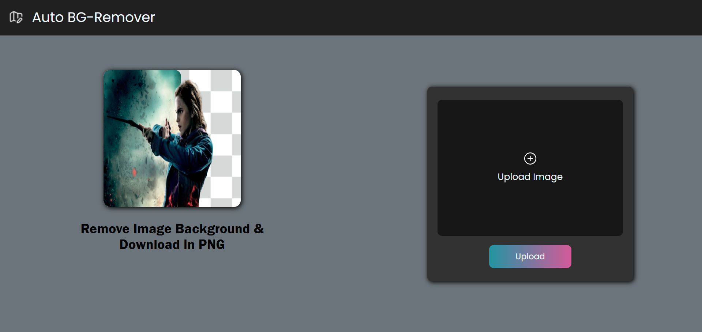

# Auto Background Remover 🖼️

A web-based tool to remove backgrounds from images using the remove.bg API. Users can upload an image, preview the result with background removed, and download the output as a PNG.

## 🔧 Features
- Upload image files (JPEG/PNG)
- Automatically remove image background
- Preview and download output in high quality
- Stylish and responsive interface

## 🚀 Technologies Used
- HTML, CSS, JavaScript
- remove.bg API
- Netlify (for deployment)

## 📷 Screenshot

## 🌐 Live Demo
[Visit on Netlify](https://bg-cleaner.netlify.app/)

